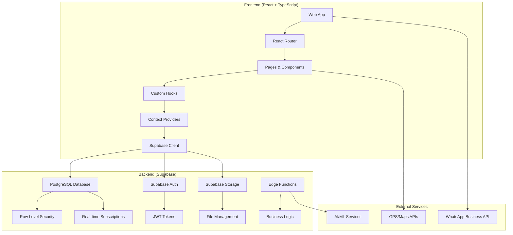
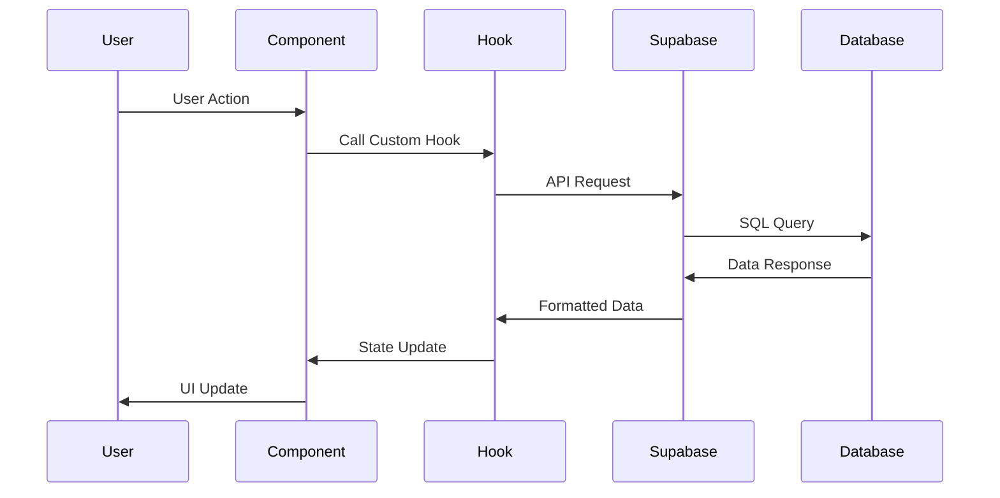
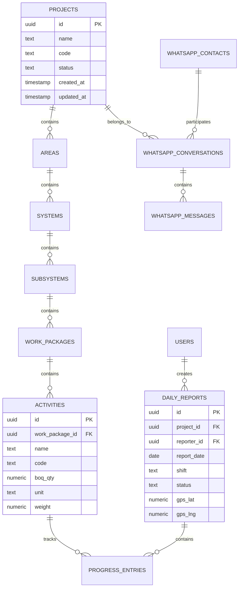

# Arquitectura del Sistema - FieldProgress

## 🏗️ Visión General de la Arquitectura

FieldProgress sigue una arquitectura **Client-Server** moderna con separación clara de responsabilidades y enfoque en escalabilidad, seguridad y rendimiento.



## 🔧 Stack Tecnológico Detallado

### Frontend
```typescript
// Core Framework
- React 18.3.1         // UI Library con Concurrent Features
- TypeScript 5.0+      // Type Safety y Developer Experience
- Vite 4.0+            // Build Tool ultra-rápido
- React Router 6.30+   // Client-side Routing

// State Management
- React Query 5.83+    // Server State Management
- Context API          // Local State Management  
- React Hook Form      // Form State Management

// UI Framework
- Tailwind CSS 3.4+    // Utility-first CSS
- shadcn/ui           // Component Library
- Radix UI            // Headless UI Components
- Recharts            // Data Visualization
- Lucide React        // Icon Library

// Development
- ESLint              // Code Linting
- TypeScript ESLint   // TS-specific Linting
- PostCSS            // CSS Processing
```

### Backend (Supabase)
```sql
-- Database
PostgreSQL 15+        -- Primary Database
Row Level Security    -- Data Security Layer
Real-time Engine     -- Live Updates
PostgREST API        -- Auto-generated REST API

-- Authentication
Supabase Auth        -- User Management
JWT Tokens          -- Stateless Authentication
Social Providers    -- OAuth Integration

-- Storage
Supabase Storage    -- File Management
CDN Integration     -- Global File Delivery
Image Optimization  -- Automatic Processing

-- Functions
Edge Functions      -- Serverless Compute
TypeScript/Deno     -- Runtime Environment
```

## 📁 Estructura de Directorios

```
fieldprogress/
├── public/                    # Archivos estáticos
│   ├── templates/            # Templates CSV/Excel
│   └── robots.txt           # SEO Configuration
├── src/
│   ├── components/           # Componentes reutilizables
│   │   ├── ui/              # Componentes de UI base (shadcn)
│   │   ├── layout/          # Layout components
│   │   ├── whatsapp/        # Componentes WhatsApp específicos
│   │   ├── analytics/       # Componentes de análisis
│   │   └── notifications/   # Sistema de notificaciones
│   ├── pages/               # Páginas principales de la app
│   │   ├── Welcome.tsx      # Landing page
│   │   ├── Auth.tsx         # Autenticación
│   │   ├── ExecutiveDashboard.tsx
│   │   ├── ProgressCapture.tsx
│   │   ├── WhatsAppBusiness.tsx
│   │   └── ...              # Otras páginas
│   ├── hooks/               # Custom React Hooks
│   │   ├── useAuth.ts       # Authentication hook
│   │   ├── useProject.ts    # Project management
│   │   ├── useWhatsApp*.ts  # WhatsApp integration
│   │   └── useAnalytics.ts  # Analytics hooks
│   ├── contexts/            # React Context Providers
│   │   ├── AuthContext.tsx  # Auth state management
│   │   └── ProjectContext.tsx # Project selection
│   ├── lib/                 # Utilities y configuración
│   │   ├── utils.ts         # Helper functions
│   │   └── seed-data.ts     # Development data
│   ├── integrations/        # External integrations
│   │   └── supabase/        # Supabase configuration
│   │       ├── client.ts    # Supabase client setup
│   │       └── types.ts     # Generated DB types
│   └── assets/              # Static assets
├── supabase/                # Supabase project configuration
│   ├── config.toml         # Project settings
│   ├── functions/          # Edge functions
│   └── migrations/         # Database migrations
├── docs/                   # Documentation
└── README.md              # Project overview
```

## 🔄 Flujo de Datos y Estado

### 1. **Client-Side State Management**

```typescript
// Authentication State (Global)
const AuthContext = createContext({
  user: User | null,
  userProfile: Profile | null,
  isLoading: boolean,
  signIn: (email, password) => Promise<void>,
  signOut: () => Promise<void>
});

// Project State (Global)
const ProjectContext = createContext({
  selectedProject: Project | null,
  projects: Project[],
  setSelectedProject: (project: Project) => void,
  isLoading: boolean
});

// Server State (React Query)
const useProjectData = (projectId: string) => {
  return useQuery({
    queryKey: ['project-data', projectId],
    queryFn: () => fetchProjectData(projectId),
    staleTime: 5 * 60 * 1000, // 5 minutes
    cacheTime: 10 * 60 * 1000  // 10 minutes
  });
};
```

### 2. **Data Flow Architecture**



### 3. **Real-time Data Synchronization**

```typescript
// Real-time subscriptions setup
useEffect(() => {
  const channel = supabase
    .channel('project-updates')
    .on('postgres_changes', {
      event: '*',
      schema: 'public',
      table: 'daily_reports',
      filter: `project_id=eq.${selectedProject.id}`
    }, (payload) => {
      // Update local state
      queryClient.invalidateQueries(['daily-reports']);
      
      // Show notification
      toast({
        title: "Nuevo reporte recibido",
        description: "Se ha actualizado la información del proyecto"
      });
    })
    .subscribe();

  return () => {
    supabase.removeChannel(channel);
  };
}, [selectedProject.id]);
```

## 🔐 Arquitectura de Seguridad

### 1. **Authentication & Authorization**

```typescript
// JWT Token Flow
User Login → Supabase Auth → JWT Token → API Requests (with Bearer Token)

// Role-based Access Control
interface UserProfile {
  id: string;
  role: 'reporter' | 'supervisor' | 'admin';
  permissions: Permission[];
}

// Permission checking
const hasPermission = (user: UserProfile, action: string, resource: string): boolean => {
  return user.permissions.some(p => 
    p.action === action && p.resource === resource
  );
};
```

### 2. **Row Level Security (RLS)**

```sql
-- Ejemplo: Solo reporteros pueden ver sus propios reportes
CREATE POLICY "reporters_own_reports" ON daily_reports
FOR SELECT USING (
  auth.uid() = reporter_id 
  OR 
  get_user_role() = 'supervisor'
);

-- Función auxiliar para obtener rol del usuario
CREATE OR REPLACE FUNCTION get_user_role()
RETURNS TEXT AS $$
  SELECT role FROM profiles WHERE id = auth.uid();
$$ LANGUAGE SQL SECURITY DEFINER;
```

### 3. **Data Validation**

```typescript
// Client-side validation (Zod)
const reportSchema = z.object({
  projectId: z.string().uuid(),
  activities: z.array(z.object({
    id: z.string().uuid(),
    quantity: z.number().min(0).max(1000)
  })).min(1),
  photos: z.array(z.instanceof(File)).max(10)
});

// Server-side validation (PostgreSQL constraints + triggers)
CREATE OR REPLACE FUNCTION validate_progress_entry()
RETURNS TRIGGER AS $$
BEGIN
  IF NEW.qty_today < 0 THEN
    RAISE EXCEPTION 'Quantity cannot be negative';
  END IF;
  RETURN NEW;
END;
$$ LANGUAGE plpgsql;
```

## 📊 Base de Datos - Diseño y Relaciones

### Entity Relationship Diagram


### 📈 Performance y Optimización

#### 1. **Database Indexing Strategy**
```sql
-- Índices para queries frecuentes
CREATE INDEX CONCURRENTLY idx_daily_reports_project_date 
ON daily_reports(project_id, report_date DESC);

CREATE INDEX CONCURRENTLY idx_progress_entries_activity_date 
ON progress_entries(activity_id, created_at DESC);

CREATE INDEX CONCURRENTLY idx_whatsapp_messages_conversation 
ON whatsapp_messages(conversation_id, created_at ASC);

-- Índices parciales para datos activos
CREATE INDEX CONCURRENTLY idx_active_contacts 
ON whatsapp_contacts(name) WHERE is_active = true;
```

#### 2. **Query Optimization**
```typescript
// Efficient data fetching with specific selects
const fetchProjectSummary = async (projectId: string) => {
  const { data } = await supabase
    .from('projects')
    .select(`
      id,
      name,
      code,
      activities:activities(count),
      reports:daily_reports(
        id,
        status,
        created_at
      )
    `)
    .eq('id', projectId)
    .single();
  
  return data;
};

// Pagination for large datasets
const fetchReports = async (projectId: string, page: number = 0, limit: number = 50) => {
  const { data } = await supabase
    .from('daily_reports')
    .select('*')
    .eq('project_id', projectId)
    .order('created_at', { ascending: false })
    .range(page * limit, (page + 1) * limit - 1);
  
  return data;
};
```

#### 3. **Client-Side Optimizations**
```typescript
// React Query configuration for optimal caching
const queryClient = new QueryClient({
  defaultOptions: {
    queries: {
      staleTime: 5 * 60 * 1000,     // 5 minutes
      cacheTime: 10 * 60 * 1000,    // 10 minutes
      refetchOnWindowFocus: false,
      retry: 3,
      retryDelay: attemptIndex => Math.min(1000 * 2 ** attemptIndex, 30000)
    }
  }
});

// Code splitting for better initial load
const WhatsAppBusiness = lazy(() => import('./pages/WhatsAppBusiness'));
const Analytics = lazy(() => import('./pages/Analytics'));

// Image optimization
const optimizeImage = (file: File): Promise<File> => {
  return new Promise((resolve) => {
    const canvas = document.createElement('canvas');
    const ctx = canvas.getContext('2d');
    const img = new Image();
    
    img.onload = () => {
      // Resize and compress logic
      canvas.width = Math.min(img.width, 1200);
      canvas.height = Math.min(img.height, 1200);
      
      ctx.drawImage(img, 0, 0, canvas.width, canvas.height);
      
      canvas.toBlob((blob) => {
        resolve(new File([blob], file.name, { type: 'image/jpeg' }));
      }, 'image/jpeg', 0.8);
    };
    
    img.src = URL.createObjectURL(file);
  });
};
```

## 🔄 CI/CD y Deployment

### Build Process
```yaml
# GitHub Actions Workflow
name: Deploy to Production
on:
  push:
    branches: [main]

jobs:
  build:
    runs-on: ubuntu-latest
    steps:
      - uses: actions/checkout@v3
      - uses: actions/setup-node@v3
        with:
          node-version: '18'
          cache: 'npm'
      
      - run: npm ci
      - run: npm run build
      - run: npm run test
      
      - name: Deploy to Vercel
        uses: vercel/action@v1
        with:
          vercel-token: ${{ secrets.VERCEL_TOKEN }}
```

### Environment Configuration
```bash
# Production Environment Variables
VITE_SUPABASE_URL=https://zsvfxfnpjwuzsynsgtym.supabase.co
VITE_SUPABASE_ANON_KEY=eyJhbGciOiJIUzI1NiIsInR5cCI6IkpXVCJ9...
VITE_APP_VERSION=1.0.0
VITE_SENTRY_DSN=https://...

# Development
VITE_SUPABASE_URL=http://localhost:54321
VITE_SUPABASE_ANON_KEY=eyJhbGciOiJIUzI1NiIsInR5cCI6IkpXVCJ9...
```

## 📊 Monitoring y Analytics

### Error Tracking
```typescript
// Sentry integration
import * as Sentry from "@sentry/react";

Sentry.init({
  dsn: import.meta.env.VITE_SENTRY_DSN,
  integrations: [
    new Sentry.BrowserTracing(),
  ],
  tracesSampleRate: 0.1,
});

// Error boundary
const ErrorFallback = ({ error, resetErrorBoundary }) => (
  <div className="min-h-screen flex items-center justify-center">
    <div className="text-center">
      <h2 className="text-2xl font-bold mb-4">Algo salió mal</h2>
      <p className="text-muted-foreground mb-4">{error.message}</p>
      <Button onClick={resetErrorBoundary}>Reintentar</Button>
    </div>
  </div>
);
```

### Performance Monitoring
```typescript
// Web Vitals tracking
import { getCLS, getFID, getFCP, getLCP, getTTFB } from 'web-vitals';

const sendToAnalytics = (metric) => {
  // Send to your analytics service
  console.log(metric);
};

getCLS(sendToAnalytics);
getFID(sendToAnalytics);
getFCP(sendToAnalytics);
getLCP(sendToAnalytics);
getTTFB(sendToAnalytics);
```

## 🚀 Escalabilidad y Futuro

### Horizontal Scaling
- **Database**: PostgreSQL Read Replicas
- **Storage**: CDN integration for global delivery
- **Functions**: Auto-scaling edge functions
- **Frontend**: Multi-region deployment

### Microservices Migration Path
```typescript
// Future: Dedicated services
- AuthService: User management
- ProjectService: Project data
- NotificationService: Real-time notifications
- ReportingService: PDF generation
- AnalyticsService: Data processing
- WhatsAppService: Message handling
```

### Technology Roadmap
- **Q2 2025**: Progressive Web App (PWA)
- **Q3 2025**: Mobile app (React Native)
- **Q4 2025**: AI/ML integration enhancement
- **Q1 2026**: Microservices architecture
- **Q2 2026**: Advanced analytics dashboard

---
**Mantenido por**: Equipo de Arquitectura  
**Última actualización**: Enero 2025